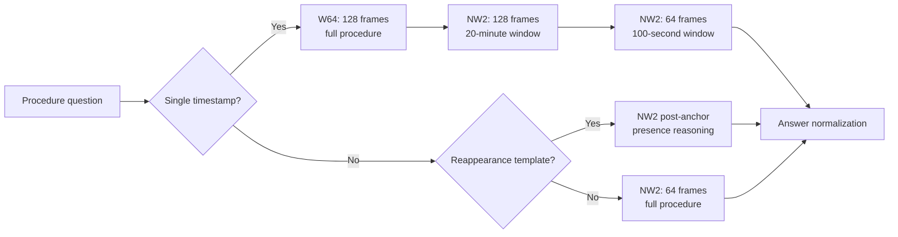

# DISCOVR-PROCEDURE: scientific method description

## Abstract

DISCOVR-PROCEDURE is a long-video question-answering method for reasoning about
foreign objects over complete surgical procedures. A procedure can last more
than an hour, making a single uniformly sampled representation too sparse for
precise temporal localization. The method therefore separates broad temporal
search from localized visual interpretation.

Two independently adapted Qwen3-VL-4B models are used. **W64** acts as a
full-procedure temporal pointer. **NW2** answers ordinary questions and refines
the temporal pointer within progressively narrower windows. The models share a
surgical scene-understanding warm start and joint supervision from the FRAME,
SEGMENT, and PROCEDURE training tracks, but they occupy distinct functional
roles during inference.

For a single-timestamp question, W64 first examines 128 frames spanning the
complete procedure. NW2 then examines 128 frames in a 20-minute window around
the initial prediction and finally 64 frames in a 100-second window. A separate
post-anchor route converts timestamped reappearance questions into direct
visual-presence questions. W64 and NW2 are loaded sequentially so that only one
4-billion-parameter model resides on the GPU at a time.

The system performs all computation locally and uses no external inference
service, detector, or manually generated test-time annotation.

## 1. Motivation

Long surgical procedures create a fundamental evidence-density problem. With
64 uniformly spaced frames over a 60-minute procedure, adjacent observations
are roughly one minute apart. Increasing the number of frames everywhere is
computationally expensive and still provides limited local detail.

DISCOVR-PROCEDURE instead implements coarse-to-fine temporal inference:

1. obtain a broad event pointer from the entire video;
2. resample densely near that pointer;
3. refine once more in a short local window; and
4. use a separate direct-answer pathway for questions that do not require
   timestamp search.

This structure treats temporal localization as an iterative search problem
while retaining a general vision-language model for object recognition,
counting, aggregation, and reasoning.

## 2. Training data

### 2.1 Joint FOCUS supervision

W64's task-specific corpus contains 34,290 official training questions from
HeiCo and LapChole. Questions from all three tracks are used so that the model
learns frame-level appearance, segment-level temporal context, and
procedure-level reasoning jointly. Retained NW2 metadata confirms supervision
from the same three tracks, but does not establish that NW2 used this exact
export or row count.

| Dataset | FRAME | SEGMENT | PROCEDURE | Total |
|---|---:|---:|---:|---:|
| HeiCo | 8,000 | 8,000 | 4,000 | 20,000 |
| LapChole | 5,730 | 5,680 | 2,880 | 14,290 |
| **Total** | **13,730** | **13,680** | **6,880** | **34,290** |

The corpus spans 20 HeiCo and 72 LapChole training videos. Its answer formats
comprise 11,531 foreign-object classification targets, 8,375 timestamps, 6,556
integers, 3,146 multiple-choice answers, 2,791 binary answers, 1,807
open-ended answers, and 84 percentages.

Each question was converted to a multimodal chat example containing its video
interval, answer format, capability label, and organizer-provided answer. A
format-specific instruction was appended to the question so that strict
answers were learned in their evaluated representation, for example a bare
integer or an `hh:mm:ss` timestamp.

This conversion did not introduce new semantic annotations. It reformatted the
official training data for supervised instruction tuning and used no test
answers.

### 2.2 Surgical scene warm-up

Both deployed models originate from a language-adapter warm start trained on
60,000 examples selected from a larger 238,925-question
SSG-VQA/CholecT45 corpus. The complete corpus contains 24,250 unique frames
from 45 laparoscopic videos and covers object presence, counting, spatial
localization, and component identification.

SSG-VQA questions were joined to CholecT45 frames using video and frame
identifiers. Alternate annotations of the same source video were
de-duplicated, and each frame contributed at most two questions from a given
question family. The original surgical scene answers were retained rather
than mapped into the FOCUS foreign-object classes.

Of the 60,000 warm-up examples, 58,800 were used for optimization and 1,200
for loss monitoring. This stage trained rank-16 adapters in the language
attention and MLP projections while keeping the visual encoder frozen.

### 2.3 Dataset provenance

The deployed models were developed from historical training snapshots
available during the challenge. A later audit of the primary FOCUS corpus
against updated dataset revisions found identifier and label changes but no
overlap with official test questions or test videos.

## 3. Visual representation

### 3.1 Frame sampling

For a video interval bounded by frame indices $i_s$ and $i_e$, $K$
chronological frames are selected as

$$
i_j = round(i_s + [j/(K - 1)](i_e - i_s)),
j = 0, ..., K - 1
$$

Indices are clamped, de-duplicated, and decoded directly. Images are
downscaled with bilinear interpolation when their longest side exceeds 768
pixels. Training images were pre-extracted to a deterministic quality-95 JPEG
cache.

FRAME examples use one image, whereas SEGMENT and PROCEDURE examples use up to
64. Inference may use 128 images for the first two stages of temporal search,
even though the task models were trained with a 64-frame cap; the additional
frames increase coverage without changing model parameters.

### 3.2 Absolute procedure time

Temporal answers use absolute procedure timestamps. The runtime receives
trimmed clips whose local time begins at zero, so each frame is annotated with

$$
t_{abs} = t_{start} + t_{clip}
$$

The resulting `hh:mm:ss` timestamp is rendered in yellow with a black outline.
The same convention was used during FOCUS fine-tuning for temporal questions.

## 4. Model training

### 4.1 Shared architecture

W64 and NW2 are independent low-rank adaptations of
Qwen3-VL-4B-Instruct. For each adapted language weight $W$, LoRA applies

$$
W' = W + (α/r)BA
$$

with rank $r=16$, alpha $α=32$, and dropout 0.05. Adapters are placed
in the query, key, value, and output attention projections and the gate, up,
and down MLP projections. The visual encoder and vision-language merger remain
frozen in both PROCEDURE models.

### 4.2 Language-only surgical warm-up

The shared warm-up adapter was trained for one epoch on four GPUs using
per-device batch size 2 and two gradient-accumulation steps, giving an
effective batch size of 16 and 3,675 optimizer updates. Training used bfloat16,
fused AdamW, learning rate $10^{-4}$, cosine decay, a 3% warm-up fraction,
zero weight decay, gradient clipping at 1.0, gradient checkpointing, and
random seed 42.

### 4.3 W64 fine-tuning

W64 continues the warm-up adapter on the 34,290-example joint FOCUS corpus.
A row-random split assigns 33,262 examples to optimization and 1,028 to loss
monitoring. Training is scheduled for three epochs on four GPUs with
per-device batch size 1 and four gradient-accumulation steps, again yielding
an effective batch size of 16.

The optimizer and precision settings match the warm-up stage. Evaluation loss
is measured every 200 optimizer steps, and the lowest-loss checkpoint is
restored at the end. The selected W64 checkpoint occurs at step 5,200,
approximately 2.5 epochs, with evaluation loss 0.2887.

### 4.4 NW2 fine-tuning

NW2 is a second rank-16 language-only adapter initialized from the same
surgical scene warm-up. It is continued jointly on FRAME, SEGMENT, and
PROCEDURE examples represented with a maximum of 64 frames. The resulting
model is used for direct answering and localized refinement rather than the
initial full-procedure pointer.

The retained model configuration establishes the base model, adapter
structure, warm start, joint-track training, and bfloat16 merge. The original
NW2 launch log and generated training manifest are not present in the current
archive, so its exact epoch count and optimizer-step selection must be
recovered before the final method submission. These values are intentionally
not inferred from the W64 recipe.

### 4.5 Learning objective

Only answer tokens contribute to the supervised loss. If $A$
denotes answer-token positions,

$$
L = -(1/|A|) ∑_{t ∈ A} log p_{θ}(y_t | x, y_{<t})
$$

System instructions, questions, padding, and visual placeholder tokens are
masked. For W64, no capability weighting, replay mixture, auxiliary digit
loss, or quantized training is used.

After fine-tuning, each adapter is independently merged into the base model in
bfloat16.

## 5. Coarse-to-fine temporal inference

### 5.1 Stage 0: full-procedure pointer

For a single-timestamp question, W64 receives 128 frames sampled over the
complete procedure and predicts an initial absolute timestamp $p_0$. This
stage favors temporal coverage over local precision.

### 5.2 Stage 1: intermediate refinement

If $p_0$ is valid, NW2 receives 128 frames from the clamped interval

$$
W_1 = [p_0 - 600s, p_0 + 600s]
$$

and predicts $p_1$. The frame spacing is now substantially smaller than in
the full-procedure view; `s` denotes seconds.

### 5.3 Stage 2: local refinement

If $p_1$ is valid, NW2 receives 64 frames from

$$
W_2 = [p_1 - 50s, p_1 + 50s]
$$

and produces the final timestamp. Every temporal stage uses the absolute-time
overlay. If a stage does not yield a parseable timestamp, the cascade stops
rather than sampling around an undefined center.

The cascade is restricted to questions requiring one timestamp. Questions
that request several time points retain a broad representation so that
refinement around one event cannot remove evidence for the others.

## 6. Direct NW2 routes

### 6.1 Ordinary questions

Questions that do not require the temporal cascade are answered by NW2 using
64 frames uniformly sampled over the full procedure. This route covers object
recognition, counting, aggregation, spatial reasoning, multiple choice, and
open-ended questions.

### 6.2 Reappearance as post-anchor presence

Some binary questions ask whether an object that was last visible before a
stated timestamp appears again. A direct full-procedure answer mixes
pre-anchor and post-anchor evidence, even though only the latter determines
the answer.

For the recognized reappearance template, the method therefore:

1. extracts the object and timestamp from the question;
2. discards all video evidence before the timestamp;
3. samples 64 chronological frames from the remaining interval; and
4. asks NW2 whether the named object is visible in any frame.

Needles are particularly small and transient. For needle reappearance, the
post-anchor interval is divided into four chronological subwindows. Each
subwindow receives 64 frames, and inference stops as soon as one subwindow
returns `yes`. If all completed subwindows return `no`, the final answer is
`no`.

This route modifies evidence and wording only; it introduces no additional
trained model.

## 7. Memory-aware batch execution

Holding both 4B models simultaneously would unnecessarily increase peak GPU
memory. The container therefore executes the batch in two phases:

1. identify temporal questions and run all W64 pointer passes;
2. store the resulting timestamps and windows on CPU;
3. release W64, run garbage collection, and clear CUDA allocations;
4. load NW2 once; and
5. run all refinements and direct-answer routes.

If a batch contains no single-timestamp question, W64 is not loaded. This
sequential-residency design keeps the maximum number of resident models equal
to one.

## 8. Prompting and output normalization

The runtime prompt contains the foreign-object definitions but no surgical
knowledge card. The answer format is inferred from the question and appended
as a concise generation constraint. Decoding is greedy.

Timestamp stages are limited to 16 new tokens, while ordinary NW2 generation
uses up to 64. Generated text is normalized to exact binary, integer,
percentage, foreign-object class, timestamp, multiple-choice, or concise
open-ended representations.

Questions are isolated by independent error boundaries, responses retain input
order, and the final answer file is written atomically.

## 9. Evaluation

The selected system achieved an official PROCEDURE pre-evaluation score of
0.4112 and a clinically restricted score of 0.5573. It answered all 1,000
questions without latency forfeits. Mean net processing time was approximately
12.49 seconds per question, excluding the platform's one-time batch setup
allowance.

| Capability | In distribution | Out of distribution |
|---|---:|---:|
| Aggregation | 0.5402 | 0.5909 |
| Complex reasoning | 0.4667 | 0.0000 |
| Object recognition | 0.6409 | 0.3758 |
| Temporal grounding | 0.5233 | 0.3742 |
| Event understanding | 0.6000 | 0.0000 |

The reappearance route was evaluated separately on matching HeiCo and
LapChole questions. It improved the targeted PROCEDURE subset from 43/71 to
60/71 correct answers. Increasing every non-needle reappearance pass from 64
to 128 frames did not improve this result and was therefore not adopted.

## 10. Limitations

The cascade can propagate a poor initial pointer into both refinement stages.
Uniform frame sampling can still miss very brief events, particularly in long
procedures. The reappearance transformation covers a narrow linguistic
template and does not generalize automatically to every temporal relation.
W64's monitoring split is row-random rather than video-disjoint. Complete
retraining reproducibility for NW2 additionally requires recovery of its
original launch log and generated training manifest.

DISCOVR-PROCEDURE is a research challenge system and is not intended for
clinical decision support.

## 11. Data and software terms

The implementation and Qwen3-VL base model are distributed under Apache-2.0.
SSG-VQA is provided for non-commercial scientific research under CC
BY-NC-SA 4.0. FOCUS, HeiCo, LapChole, CholecT45, and associated videos remain
subject to their respective owners' access and licensing terms. No raw patient
videos or private challenge annotations are included in this release.
