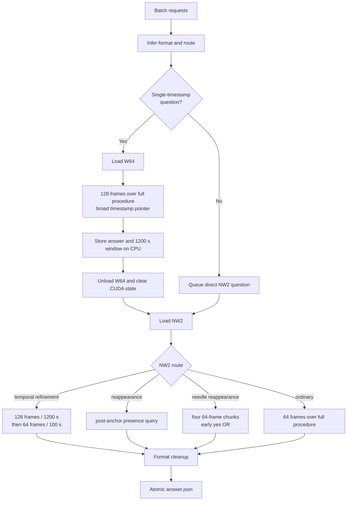

# DISCOVR-PROCEDURE: detailed method description

> Draft for the ORena SAVE FOCUS 2026 method-description submission.
> Reconstructed on 8 September 2026 from the selected container, public
> checkpoints, training manifests, trainer states, run scripts, cross-machine
> handoffs, and artifact checksums.

## 1. Submission identification

| Field | Value |
|---|---|
| Team | Incision Impossible |
| Public method name | DISCOVR-PROCEDURE |
| Track | PROCEDURE |
| Grand Challenge algorithm | `DISCOVR PROCEDURE T1` |
| Method ID | `c0a82e5c-3b0c-4d54-bed3-777e1dc218af` |
| Selected image version | `abe8063f-78f1-43ea-93ea-0b70c3eca1cd` |
| Pre-evaluation ID | `a8fa6296-e08b-40b7-b2e5-759ba657fe6d` |
| Base model family | `Qwen/Qwen3-VL-4B-Instruct` |
| Released checkpoints | W64 and NW2, merged bfloat16 |

The exact source release is
[`mdivyanshu97/orena-focus-procedure`](https://github.com/mdivyanshu97/orena-focus-procedure).
Both merged checkpoints are published at
[`Div97/orena-focus-procedure-w64-nw2`](https://huggingface.co/Div97/orena-focus-procedure-w64-nw2).

## 2. Abstract

DISCOVR-PROCEDURE answers foreign-object questions over long surgical
procedures with a sequential two-model Qwen3-VL system:

- **W64** provides a broad full-procedure pointer for single-timestamp
  questions.
- **NW2** answers ordinary questions, performs localized timestamp
  refinement, and handles a targeted post-anchor reappearance route.

Both checkpoints are independently merged LoRA adaptations of
Qwen3-VL-4B-Instruct. They are never resident on the GPU simultaneously:
the container runs all W64 work, releases W64 and its CUDA allocations, then
loads NW2 once for the remaining work.

The method combines joint all-track supervised fine-tuning, deterministic
answer-format inference, absolute-time overlays, a three-pass temporal
cascade, and a narrow inference-time rewrite for reappearance questions. It
uses no network service, external API, retrieval index, or human interaction.

## 3. System overview



## 4. Models

### 4.1 Shared base

Both models use
[`Qwen/Qwen3-VL-4B-Instruct`](https://huggingface.co/Qwen/Qwen3-VL-4B-Instruct)
and were merged in bfloat16. Neither selected model is the FullVis model used
by DISCOVR-SEGMENT.

### 4.2 W64

W64 is the language-only SSG-warm-start model
`q3vl4b_alltracks_ssgwarm64f_bf16_e3`.

Its LoRA adapter targets seven language projections:

- attention: `q_proj`, `k_proj`, `v_proj`, `o_proj`;
- MLP: `gate_proj`, `up_proj`, `down_proj`.

The LoRA configuration is rank 16, alpha 32, dropout 0.05, no bias
adaptation, and no DoRA. The vision encoder and merger are frozen.

### 4.3 NW2

The surviving merge provenance identifies NW2 as:

| Field | Recovered value |
|---|---|
| Adapter name | `q3vl4b_nw2` |
| Adapter role | continued adapter |
| Warm start | language-only `q3vl4b_ssg_aux` |
| Training manifest | `capped_v1_64f.jsonl` |
| Tracks | FRAME, SEGMENT, PROCEDURE |
| LoRA rank / alpha | 16 / 32 |
| Quantization | none |
| Merge | `peft.merge_and_unload`, bfloat16 |
| Adapter hash head | `59a7ced331f55fe8197938e6045e171c5486651f83ceb021e71c80d51e432b83` |

Because NW2 continued the language-only SSG adapter, its trainable LoRA sites
were the same seven language projections as W64. It did not use the
FullVis vision/merger adaptation.

The original NW2 adapter directory, `capped_v1_64f.jsonl`, and launch log were
created on the peer H200 training machine and are not present in the surviving
handoff. Consequently, the exact NW2 row count, manifest-generation rule,
epoch count, batch configuration, optimizer schedule, and selected optimizer
step cannot be stated as recovered facts. They are listed explicitly in
Section 18 rather than being inferred from W64 defaults.

## 5. Shared FOCUS training data

W64 used `alltracks_train_v2_64f.jsonl`, a joint official-train export.

| Property | Value |
|---|---:|
| Rows | 34,290 |
| File size | 196,783,311 bytes |
| SHA-256 | `48f79a5ae40971a43c47bf8686d26280a0d24a2eecf0ce4e2de2f70020c177da` |
| MD5 | `4977ecd14092719ab797760de09f37b7` |
| HeiCo rows | 20,000 |
| LapChole rows | 14,290 |
| FRAME rows | 13,730 |
| SEGMENT rows | 13,680 |
| PROCEDURE rows | 6,880 |

Breakdown by dataset and track:

| Dataset | FRAME | SEGMENT | PROCEDURE | Total |
|---|---:|---:|---:|---:|
| HeiCo | 8,000 | 8,000 | 4,000 | 20,000 |
| LapChole | 5,730 | 5,680 | 2,880 | 14,290 |

The source manifest referenced 20 HeiCo training videos and 72 LapChole
training videos overall.

Answer formats:

| Format | Rows |
|---|---:|
| Foreign-object class | 11,531 |
| Timestamp | 8,375 |
| Integer | 6,556 |
| Multiple choice | 3,146 |
| Binary | 2,791 |
| Open ended | 1,807 |
| Percentage | 84 |

## 6. FOCUS data generation

Each official training question was converted into one chat-style SFT record
containing its dataset, track, question ID, source-video path, annotated time
interval, system prompt, question, format hint, organizer-provided answer,
answer format, primary capability, frame count, and overlay flag.

No new human FOCUS annotations were created. The builder reformatted official
training annotations; it did not use test answers or pseudo-labels.

The selected manifest assigned one frame to FRAME rows and 64 frames to both
SEGMENT and PROCEDURE rows. Temporal overlays were enabled for timestamp,
temporal-localization, duration-estimation, and temporal-ordering rows, giving
8,732 overlay rows.

Frames were uniformly sampled within the annotated interval, downscaled to a
maximum side of 768 pixels, and cached as quality-95 JPEG files. Temporal rows
received a yellow, black-outlined absolute-procedure clock derived from source
frame index and FPS.

The selected historical manifest contained different system-prompt snapshots:
HeiCo rows included the then-current surgical knowledge card, while LapChole
rows did not. The deployed PROCEDURE prompt does not include the card.

## 7. Historical dataset-snapshot note

W64 used the exact July 2026 manifest identified by the hashes above. A later
audit against newer dataset revisions found 5.3% row revision drift but:

- zero official test-split rows;
- zero answer-format drift on joined rows;
- zero cross-track ID artifacts; and
- no evidence that the builder invented labels.

Thirty-nine LapChole targets contained `Unknown foreign object`; this was a
real value in an older upstream revision and was removed later. Corrected
manifests were built, but W64 continued to use the historical export.

The exact relationship between `capped_v1_64f.jsonl` and this historical
all-track export—and whether it incorporates the same historical rows—must
still be recovered from the peer training machine.

## 8. SSG-VQA warm start used by W64 and NW2

The language-only `q3vl4b_ssg_aux` adapter was trained on a 60,000-row subset
of a larger 238,925-row SSG-VQA/CholecT45 scene-literacy manifest:

- 58,800 rows were used for optimization;
- 1,200 rows were held out for row-random evaluation;
- one epoch produced 3,675 optimizer steps at global batch 16.

The full source manifest was generated by pairing
[SSG-VQA](https://github.com/camma-public/ssg-vqa) questions with CholecT45
frame records. It contains 45 source videos and 24,250 unique frames.

The retained question types were spatial localization, count, existence,
component query, and presence. The builder capped each `(frame, question
type)` cell at two questions and kept the original scene answers rather than
mapping them to FOCUS labels.

The warm-up configuration recovered from `training_args.bin` and the final
adapter is:

| Hyperparameter | Value |
|---|---|
| Base | Qwen3-VL-4B-Instruct |
| Holdout split seed | 0 |
| Epochs | 1 |
| GPUs | 4 |
| Per-device batch | 2 |
| Gradient accumulation | 2 |
| Effective global batch | 16 |
| Optimizer steps | 3,675 |
| Learning rate | `1e-4` |
| Optimizer | fused AdamW |
| Scheduler | cosine |
| Warm-up ratio | 0.03 |
| Weight decay | 0 |
| Gradient clipping | 1.0 |
| Precision | bfloat16 |
| Gradient checkpointing | enabled |
| LoRA | language-only, rank 16, alpha 32, dropout 0.05 |
| Seed | 42 |

The surviving files do not identify the exact rule used to choose the
60,000-row subset from the larger manifest. This is a provenance item to
recover, not an assumption to fill with a new sampling rule.

SSG-VQA is provided for non-commercial scientific research under CC
BY-NC-SA 4.0. Users of the released checkpoints remain responsible for the
source data terms.

## 9. W64 fine-tuning

W64 continued the language-only SSG adapter on the 34,290-row FOCUS manifest.

| Hyperparameter | Value |
|---|---|
| Row-random evaluation holdout | 3% |
| Training rows | 33,262 |
| Evaluation rows | 1,028 |
| Holdout split seed | 0 |
| Epochs scheduled | 3 |
| GPUs | 4 |
| Per-device batch | 1 |
| Gradient accumulation | 4 |
| Effective global batch | 16 |
| Total schedule | 6,237 optimizer steps |
| Learning rate | `1e-4` |
| Optimizer | fused AdamW |
| Scheduler | cosine |
| Warm-up ratio | 0.03 |
| Weight decay | 0 |
| Gradient clipping | 1.0 |
| Precision | bfloat16 |
| Gradient checkpointing | enabled |
| Maximum frames | 64 |
| Maximum image side | 768 pixels |
| Seed | 42 |
| Best-checkpoint criterion | lowest evaluation loss |

The best checkpoint was step 5,200, approximately epoch 2.50, with evaluation
loss 0.2887436. `load_best_model_at_end` restored that checkpoint before the
top-level adapter was saved and merged.

The exact launch recipe is reproducible from the surviving run script:

```text
base=Qwen/Qwen3-VL-4B-Instruct
init_adapter=q3vl4b_ssg_aux
data=alltracks_train_v2_64f.jsonl
tracks=frame,segment,procedure
epochs=3
per_device_batch=1
gradient_accumulation=4
world_size=4
learning_rate=1e-4
max_frames=64
max_long_side=768
temporal_overlay=true
eval_fraction=0.03
load_best=true
```

## 10. Training objective

The system applied the Qwen chat template to the system prompt, sampled image
sequence, and format-augmented question. Padding, the complete prompt, and
vision placeholders were masked, so cross-entropy was computed only on the
gold answer tokens.

The loss was the mean over supervised answer tokens and then over examples.
No capability weighting, replay mixture, auxiliary digit loss, or 4-bit
quantization was used in W64. A trailing-logit optimization avoided allocating
full-vocabulary logits for thousands of masked visual/prompt positions without
changing the supervised objective.

NW2's merge provenance confirms the same adapter family and warm start, but
the unavailable launch log prevents claiming that every optimizer setting
matched W64.

## 11. Model merge and hashes

Both adapters were merged into Qwen3-VL-4B-Instruct with
`peft.merge_and_unload` and saved in bfloat16.

| Artifact | SHA-256 |
|---|---|
| W64 `model.safetensors` | `0647d7204fccbf708e5b15d8312d03062e86bea61310580b5eca97999c33fe4d` |
| NW2 `model.safetensors` | `3c032078c4e98a33bd7deb6b0f285ed45f0414d118fa1a086bd35d64546ba3e9` |
| Selected `inference.py` | `3d12f0bd959408a6ae1f88f325e56e0e20d6097af7ec38e0e9cba7c7e84dbd7b` |

Each merged weight file is 8,875,719,408 bytes.

## 12. Inference

### 12.1 Prompt, format, and video time

The container uses its bundled foreign-object definitions and a concise
surgical VQA instruction. The PROCEDURE knowledge card is disabled.

Because answer format is absent from runtime requests, a deterministic
question-text classifier infers binary, integer, percentage, class, timestamp,
multiple-choice, or open-ended output. It selects the format instruction and
cleanup function.

The platform-provided overlayed clip starts its clock at the trimmed clip
boundary. The model was trained with absolute procedure time, so the container
decodes the plain clip and redraws the absolute clock as:

`request start_time + frame offset`.

### 12.2 Sequential model residency

The batch is divided into two phases:

1. W64 is loaded only if the batch contains a single-timestamp route.
2. W64 runs every broad stage-0 pointer.
3. Small CPU records retain the answer, translated window, timing, and failure
   state.
4. W64 is deleted, Python garbage collection runs, and CUDA caches are cleared.
5. NW2 is loaded and warmed once.
6. NW2 performs refinements and all direct routes.

This bounds peak residency to one 4B model.

### 12.3 Temporal cascade

The temporal route is restricted to questions requiring one timestamp.

| Stage | Model | Evidence |
|---|---|---|
| 0 | W64 | 128 frames across the full procedure |
| 1 | NW2 | 128 frames in a 1,200-second window centered on the W64 timestamp |
| 2 | NW2 | 64 frames in a 100-second window centered on the Stage-1 timestamp |

All temporal passes use the absolute-time overlay and a 16-token generation
cap. A later stage runs only when the previous answer contains a valid
timestamp. Windows are translated to clip-relative coordinates and clamped to
the available video.

Multi-event timestamp-list questions skip this single-center cascade.

### 12.4 Ordinary questions

NW2 answers ordinary questions directly with 64 frames uniformly sampled over
the complete procedure. Images are downscaled to a maximum side of 768 pixels.
Generation is greedy and deterministic, with a 64-token cap.

### 12.5 Reappearance-presence route

The runtime recognizes the narrow binary template:

> Does the object, last visible just before `<timestamp>`, re-appear later in
> the video?

For matching rows, it samples only after the timestamp and rewrites the
question as direct visual presence:

> Looking only at these chronological frames, is the named object visible in
> any frame?

For ordinary objects, NW2 receives one 64-frame post-anchor view. Needle uses
four chronological post-anchor chunks of 64 frames each because the object can
be very brief. The system stops early and returns `yes` if any chunk returns
`yes`; completed all-`no` chunks return `no`.

This is an inference-time transformation. It introduced no new training label
or model parameter.

### 12.6 Output normalization and reliability

Generated text is normalized into the evaluator's strict formats. The
container preserves request order, isolates per-question failures, emits one
response per recoverable question ID, and writes `answer.json` atomically.
Model setup failures are raised rather than converted into an all-empty batch.

### 12.7 Container environment

The released `linux/amd64` image is based on
`pytorch/pytorch:2.11.0-cuda12.8-cudnn9-runtime`. Principal pinned runtime
packages are PyTorch 2.11.0, `orena-focus` 0.3.5, Transformers 5.4.0,
`qwen-vl-utils` 0.0.14, PEFT 0.19.1, Accelerate 1.14.0, and Safetensors
0.7.0. A build-time guard checks that the installed PyTorch remains a CUDA
12.8 build with the required GPU architectures.

## 13. Model and route selection

W64 was retained as the broad pointer because its full-procedure temporal
localization complemented NW2's localized answering. NW2 was retained for
ordinary questions and refinement based on paired local evaluation.

The reappearance route was tested on matching HeiCo and LapChole questions:

| Track subset | Baseline | Reappearance route |
|---|---:|---:|
| HeiCo PROCEDURE | 13/24 | 23/24 |
| LapChole PROCEDURE | 30/47 | 37/47 |
| Combined | 43/71 | 60/71 |

A blanket change from 64 to 128 post-anchor frames was rejected: with the
four-chunk Needle route retained, it reduced the combined targeted result from
60/71 to 59/71.

These local gates guided route selection; they are not presented as hidden
test-set estimates.

## 14. Official pre-evaluation result

| Metric | Value |
|---|---:|
| Technical pre-evaluation score | 0.4112059082 |
| Clinical pre-evaluation score | 0.5572717020 |
| Clinically relevant questions | 782 |
| Questions | 1,000 |
| Batches | 5 |
| Questions forfeited | 0 |
| Questions unanswered | 0 |
| Mean batch duration | 2,617.8435 s |
| Mean net latency per question | 12.4892 s |
| Throughput including setup | 0.0764 questions/s |

Bucket accuracies:

| Capability | In distribution | Out of distribution |
|---|---:|---:|
| Aggregation | 0.5402 | 0.5909 |
| Complex reasoning | 0.4667 | 0.0000 |
| Object recognition | 0.6409 | 0.3758 |
| Temporal grounding | 0.5233 | 0.3742 |
| Event understanding | 0.6000 | 0.0000 |

## 15. Reproducibility and public artifacts

The public release contains:

- the exact selected inference code;
- W64 and NW2 merged checkpoints;
- pinned download and SHA-256 verification;
- Docker build, smoke-test, and export scripts;
- route modules and candidate provenance; and
- this detailed method-description draft.

Raw challenge videos, patient data, and organizer annotations are not
redistributed.

## 16. Limitations

- Sparse uniform sampling can miss short events in long procedures.
- The cascade depends on a usable earlier timestamp; pointer error propagates
  into later windows.
- The reappearance rewrite applies only to a narrow recognized template.
- W64's training-loss holdout was row-random, not video-disjoint.
- The selected FOCUS manifests predate later upstream revisions.
- NW2's exact training launch and source manifest have not yet been recovered.
- This is a challenge research prototype, not a medical device or clinical
  decision-support system.

## 17. Licensing and data governance

- Repository code: Apache-2.0.
- Qwen3-VL base model: Apache-2.0.
- SSG-VQA: CC BY-NC-SA 4.0 for non-commercial scientific research.
- FOCUS, HeiCo, LapChole, CholecT45, and challenge assets: governed by their
  respective owners and access terms.

No credentials, raw patient videos, or private test annotations are included
in the release.

## 18. Items that must be verified before portal submission

The following are the only material training-provenance gaps in the current
draft:

1. recover `capped_v1_64f.jsonl` or its generation report;
2. record its row count, dataset/track distribution, and checksum;
3. recover NW2's exact launch command, optimizer settings, epoch count, random
   seed, evaluation split, and selected optimizer step;
4. recover the rule used to select the 60,000-row SSG subset for
   `q3vl4b_ssg_aux`;
5. add the final author list, affiliations, and corresponding contact;
6. apply any organizer template or page limit; and
7. confirm the deadline in the live Grand Challenge portal, because the static
   challenge dates page and portal text have shown different September dates.

Until items 1–4 are recovered, the public checkpoint hashes and exact
inference behavior are reproducible, while NW2 retraining is only partially
reconstructable.
