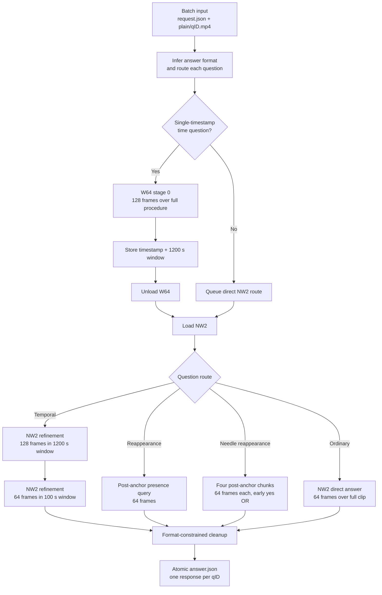

# DISCOVR-PROCEDURE

Reproducible release of **DISCOVR-PROCEDURE**, submitted to the ORena SAVE
FOCUS 2026 PROCEDURE track by team **Incision Impossible**.

This repository contains the W64→NW2 inference implementation used for the
reported challenge result, a scientific account of the method, and reproducible
build and verification commands. The two merged checkpoints are hosted
separately on Hugging Face.

## Challenge result

| Field | Value |
|---|---|
| Algorithm | `DISCOVR-PROCEDURE` |
| Team | Incision Impossible |
| Track | PROCEDURE |
| Technical pre-evaluation score | `0.4112059081777602` |
| Clinical pre-evaluation score | `0.5572717019874663` |
| Forfeited / unanswered | `0 / 0` |

## Method at a glance

DISCOVR-PROCEDURE packages two independently merged
`Qwen/Qwen3-VL-4B-Instruct` checkpoints. It executes them in two phases so that
at most one 4B model is resident on the GPU.



The temporal cascade uses frame counts `(128, 128, 64)` and full window widths
`(1200 s, 100 s)`. See [METHOD.md](METHOD.md) for the concise implementation
description and [METHOD_DESCRIPTION.md](METHOD_DESCRIPTION.md) for the detailed
scientific method description covering the research rationale, data
construction, model adaptation, coarse-to-fine temporal inference, evaluation,
and limitations.

## Weights

Both merged checkpoints are hosted at:

`https://huggingface.co/Div97/orena-focus-procedure-w64-nw2`

Download and verify:

```bash
python -m pip install huggingface_hub
python scripts/download_weights.py
python scripts/verify_release.py
```

Expected model hashes:

```text
W64 0647d7204fccbf708e5b15d8312d03062e86bea61310580b5eca97999c33fe4d
NW2 3c032078c4e98a33bd7deb6b0f285ed45f0414d118fa1a086bd35d64546ba3e9
```

The download script pins Hugging Face revision
`4b49db331bf8e49007d19135aee48dfcf27c1bfa`.

## Build

```bash
python scripts/download_weights.py
python scripts/verify_release.py
./do_build.sh
./do_save.sh
```

To run `./do_test_run.sh`, first provide a compatible Grand Challenge fixture
under `test/input/interface_1/`. The original fixture is intentionally not
redistributed because challenge videos and annotations are not part of this
source release.

## Included release scripts

- `scripts/download_weights.py` downloads both exact checkpoints at their
  pinned Hugging Face revision.
- `scripts/verify_release.py` verifies the recovered source and both model
  SHA-256 values.
- `do_build.sh` validates that both checkpoints are present and builds the
  `linux/amd64` challenge image.
- `do_test_run.sh` runs the image offline with the NVIDIA runtime and checks
  that `answer.json` contains exactly one response per request.
- `do_save.sh` rebuilds and exports the uploadable Docker archive.

## Reproducibility and provenance

See [TRAINING.md](TRAINING.md),
[METHOD_DESCRIPTION.md](METHOD_DESCRIPTION.md),
[resources/candidate_provenance.json](resources/candidate_provenance.json),
and [provenance/release.json](provenance/release.json).

## Data and safety

No patient videos, challenge cases, credentials, or raw challenge annotations
are included. Users must obtain datasets under their original terms. This is a
research challenge system and is not a medical device or a clinical decision
support product.

## License

Code is released under Apache-2.0. The base Qwen3-VL model is also distributed
under Apache-2.0. Dataset licenses and terms remain with their respective
owners. See [NOTICE](NOTICE).
